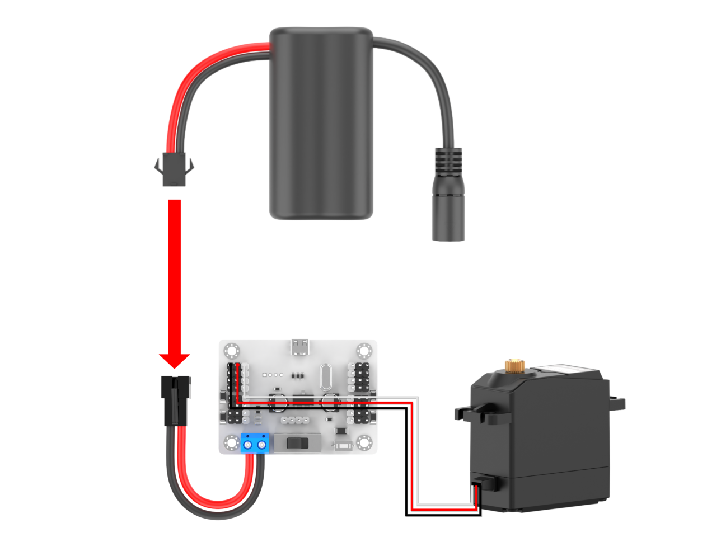
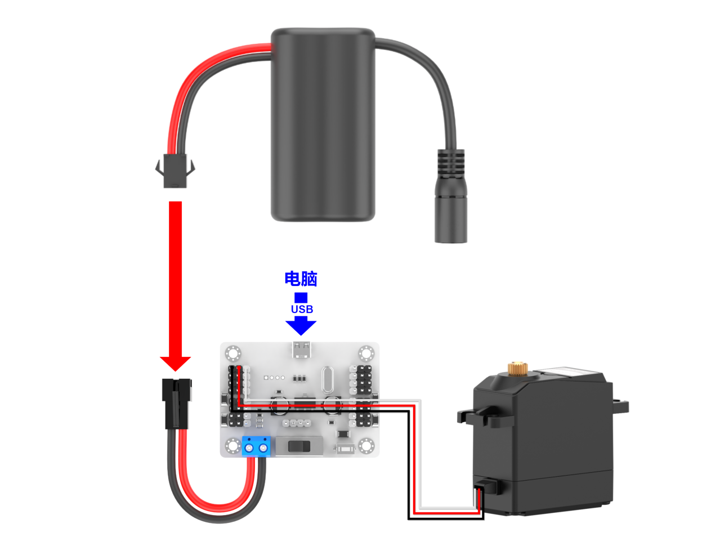
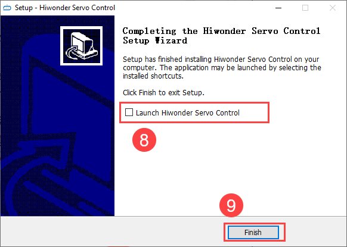

# 1. LSC-16 Servo Controller User Manual

## 1.1 Product Introduction

The 16-channel servo controller will bring you a good experience with its 9 features.

The CPU uses a high-performance `STM32` microcontroller with an `ARM Cortex-M3` core, which can control 16 servos with high precision and adjustable speed.

(1) Easy wiring. Servo controller has only anode and cathode power ports.

(2) User-friendly built-in switch.

(3) Support online debugging, no need to install drivers.

(4) 16M high-capacity memory, which is able to hold 230 action groups! Each action group can hold up to 510 actions.

(5) Support two offline running modes, which can run once or loop offline.

(6) Serial communication support: Allows communicate with other microcontrollers for intelligent robot control.

(7) Equipped with 8-channel overload protection, prevent the servo from getting blocked.

(8) Built-in signal isolation protection: Isolates the servo output from the CPU. This helps avoid damage to the CPU caused by servo current surges.

## 1.2 Interface and Power Supply Instruction

### 1.2.1 Interface Instruction

| Interface/Button Name | Function |
|:---:|:---|
| Micro USB port | Connect the servo controller to PC, allowing them to communicate. |
| 8-11 Channels servo interface | 8-11 Channels servo control interface. |
| 12-15 Channels servo interface | 12-15 Channels servo control interface with over-current protection. |
| Secondary development serial communication interface | Used for serial communication between the controller and other development platforms. |
| LED1 & LED2 | LED1 power indicator: Lights up after power-on. LED2 communication indicator: Lights up when a signal is received. |
| Offline operation button | Press to run the 100th action group file offline. |
| Power switch | Control the power connection of the controller. |
| Power interface | Lithium battery connection port. |
| 0-3 Channels servo interface | 0-3 Channels servo control interface with over-current protection. |
| 4-7 Channels servo interface | 4-7 Channels servo control interface. |

### 1.2.2 Power Supply Instruction

The power supply interfaces on the 16-channel servo controller are shown below:

Its power supply voltage is between 5-8.4V. It can be powered by a 7.4 lithium battery.

:::{Note}

The supply voltage must not exceed 8.4V. If it exceeds 8.4V, it may damage the controller.
:::

Powered by a 7.4V lithium battery

The positive and negative terminals must be matched correctly.

## 1.3 PC Software Introduction

The servo and the servo arm used in this lesson are for demonstration only. Please rely on the actual situation.

### 1.3.1 Setup PC Software Control Environment

* **Setup Hardware Environment**

The required materials are shown below:

| Name | Qty |
|:---:|:---:|
| 16-channel servo controller | 1 |
| LD-3015MG servo | 1 |
| USB cable | 1 |
| Battery connection cable | 1 |
| 7.4V lithium battery | 1 |

(1) Step 1: Connect the `LD-3015MG` servo to any servo port on the 16-channel servo controller. Let’s take connecting to port 1 as an example. Connect the white wire to the **"S"** pin. The positive and negative terminals must be matched correctly.

(2) Step 2: Connect the battery connection cable to the power interface on the servo controller, and connect the lithium battery.

:::{Note}

connect the red wire to **"+"**, and the black wire to **"-"**. The positive and negative terminals must be matched correctly.
:::

(3) Step 3: Connect the servo controller to your PC with the USB cable. Switch the servo controller on.

* **Setup Software Environment**

Locate the [Hiwonder Servo Control Steup.exe]() in [Appendix -> PC Software](), and double-click to install it.

Install the software according to the installation prompts.

### 1.3.2 PC Software Interface Introduction

(1) Double-click  to open the PC software.

(2) The interface consists of six areas: ① Language and servo selection area, ② Device connection area, ③ Servo control area, ④ Action group details list, ⑤ Action group setting area, ⑥ Deviation setting area.

* **Language and servo selection**

Select the display language of the interface and the servo connected.

| Icon | Function Description |
|:---:|:---|
|  | Click the dropdown button on the right to select the display language of the interface.  |
|  | Servo selection area, all are checked by default. When in use, uncheck the servos that are not connected, and only keep the ones that are connected.  |
|  | Click to uncheck the currently selected servos. |
|  | Click to check the currently unselected servos. |

* **Device connection area**

In this area, you can connect the servo controller and check its connection status.

| Icon | Function Description |
|:---:|:---|
|  | Wired connection status button. After the controller is connected to the computer, the button turns green.  |

* **Servo control area**

You can change the corresponding servo values to adjust the rotation position of the servo.

| Icon | Function Description |
|:--:|:---|
|  | Interface number for the servo to be connected. |
|  | Adjust the angle position of the servo, with a value range of 500 to 2500. |
|  | Note: It is the small slider under the icon, used to adjust the servo deviation, with a value range of -100 to 100. To prevent misoperation, please click the **"Read Deviation"** button before dragging the deviation adjustment slider. For deviation adjustment, please refer to **"6.Servo Deviation Adjustment"**. |

* **Action details list**

Check the execution time and servo parameters of the action.

| Icon | Function Description |
|:---:|:---|
|  | Run the currently selected action. |
|  | Action number. |
|  | Action running time, which is the time it takes to execute the action. Unit: ms. |
|  | Servo parameter list. |
|  | #1: servo ID 1; P1500: The rotation position of servo ID 1. |

* **Action group setting**

Run, open, add, delete, modify, and view action groups and action group files.

| Icon | Function Description |
|:---:|:---|
|  | Click the dropdown button on the right to select the currently available action group. |
|  | Download the action group in the action details list to the servo controller for action group calling. |
|  | Delete the currently selected action group file and cannot be retrieved. |
|  | (Caution) Delete all action group files and cannot be retrieved. |
|  | Execute the selected action group once. |
|  | Stop the running action group. |
|  | Integrate the servo values in the current servo control area into an action, and add it to the last row of the action details list. |
|  | Delete the selected action in the action details list. |
|  | Replace the servo parameters of the selected action in the action details list with the current servo control area values, and replace the action execution time with the value set for **"Action Time"**. |
|  | Insert a new action group above the selected action group. |
|  | The time required to run a single action. It can be directly modified in the box. The unit is ms. |
|  | Click  to select and play music from your computer. |
|  | Execute the actions in the action details list once, and check **"Loop"** to execute the actions in a loop. |
|  | Open the specified action group file. |
|  | Integrate the actions in the action details list into an action group file, and save it to the specified location. |
|  | When the action details list is not empty, click the button to link the specified action group to the end of the list. |

* **Deviation setting**

The servo deviation can be set in this area. For specific operations on deviation adjustment, please refer to [1.6 Servo Deviation Adjustment]().

| Icon | Function Description |
|:--:|:---|
|  | Restore all servo parameters in the servo control area to 1500. |
|  | Read the current servo deviation value. |
|  | Save the adjusted servo deviation value to the controller. |
|  | Restore the servo deviation to 0. |

## 1.4 Online Computer Debugging

### 1.4.1 Install Serial Port Driver

:::{Note}
* Before using the PC software, please ensure that the computer has installed the `CH341` serial port driver. Otherwise, it may affect its subsequent connection and use.

* If the `CH341` serial port driver has been installed, you can skip this step.
  :::

(1) Locate and open the `ch341ser.exe` serial port driver installation package in the "PC Software Installation Package" in the same directory as this section.

(2) Click the Install button, and then the Install and Uninstall buttons will turn gray. Wait a moment for the prompt of successful installation.

### 1.4.2 Servo Status Instruction

The following three images show the three basic positions of a servo motor: neutral position, maximum position, and minimum position. To provide a clear visual reference, a servo horn is included as an example. The label is placed on the right side of the servo horn, representing the initial position.

Neutral position: 90° servo angle, which is corresponding to the position of 1500

Minimum position: 0°servo angle, which is corresponding to the position of 500

Maximum position: 180°servo angle, which is corresponding to the position of 2500

### 1.4.3 Wired Connection Debugging

For Wired connection, the servo controller needs to be connected to the computer with a USB cable.

(1) Please refer to [1.3.1 Setup PC Software Control Environment]() to connect the servo controller and servo to the PC software.Check the box for servo 1. You can check based on the actual servo number.

(2) Click **"Reset servo"** to make the servo return to the neutral position, and the servo is at the 90° position.

:::{Note}

The servo will not automatically return to the neutral position immediately after power-on. Attempting to operate the servo directly via the panel may cause damage to the servo.
:::

(3) Drag the slider below the servo ID to make the servo rotate to 180° and 0° positions respectively.

<table class="" style="text-align: center;width: 600px;">
    <tbody>
    <tr>
        <td></td>
        <td></td>
    </tr>
    <tr>
        <td></td>
        <td></td>
    </tr>
    <tr>
        <td>180°servo angle, which is corresponding to the position of 2500</td>
        <td>0°servo angle, which is corresponding to the position of 500</td>
    </tr>
    </tbody>
</table>

## 1.5 Edit and Call Action Group

### 1.5.1 Edit Action Group

Let’s demonstrate on connecting a servo 1, and making it rotate left and right.

(1) Please refer to [1.3.1 Setup PC Software Control Environment]() to connect the servo to the PC software, and check the box for servo 1.For the selection of servos, please rely on the actual situation.

(2) Click **"Reset servo"** to make the servo in the neutral position.

(3) Set the action time to 1000ms, click **"Add Action"**. Add this action to the action details list.

(4) Then rotate the servo to the right. Set the action time to 1000ms, click **"Add Action"**, and add this action to the action details list.

(5) You can add a transition action between two actions to make the actions more naturally connected. Based on the previous action, keep the servo value unchanged. Directly modify the action time, generally between 100-300ms. Then click **"Add Action"** again.

(6) Return the servo to the neutral position, set the time to 1000ms. Click **"Add Action"**.

(7) Set the transition action. Set the time to 200ms, and click **"Add Action"**.

(8) Rotate the servo to the left. Set the time to 1000ms, and click **"Add Action"**.

(9) Set the transition action. Set the time to 200ms, and click **"Add Action"**.

(10) Next, return the servo to the neutral position. Set the time to 1000ms, and click **"Add Action"**.

(11) After the action editing is completed, click **"Save Action File"** to save the edited action group file to the local computer.

:::{Note}

The save path can be customized. For easy calling later, it is recommended to name the file as **"number+action group name"**. For example, **"No.10 Rotate Left and Right"**. When calling it later, you only need to input the action group number **"10"**.
:::

### 1.5.2 Call Action Group

After saving the action group, if you want to run the action group again, you can directly run it through the **"Online Run"** button, or run it by calling the **"Action Group Run"** button in the action list. The method of calling the action group is as follows:

(1) Please refer to [1.3.1 Setup PC Software Control Environment]() to connect the servo to the PC software.

(2) Select an action group number in the dropdown list of the action group. Let’s take No. 10 as an example. You can select it based on you own needs. No.100 is the action group for offline control. When using the offline function, the action group can be downloaded to 100.

(3) After selecting the action group number, click **"Download"** to download the actions in the action details list to the **"Action Group"** number. When you hear a ‘beep’ sound from the buzzer, and a pop-up window appears on the page, it means that the download is completed.

(4) Click **"Run Action Group"** to run the new No. 10 action group.

## 1.6 Servo Deviation Adjustment

The meshing of the servo shaft with the servo arm or servo horn is based on gears. Therefore, it’s difficult to install the servo arm or servo horn to a specific position during installation. In this case, you can use the PC software to adjust the deviation of the servo to make it rotate to a specific position.

This section takes the example of adjusting the servo arm of servo 1 to a 90-degree position. The adjustment method for other servos is the same.

### 1.6.1 Getting Ready

Please refer to [1.3.1 Setup PC Software Control Environment]() to connect the servo controller and the servo to the PC. Select servo 1. The number can be checked based on the actual situation.

### 1.6.2 Deviation Judgment

(1) If the servo returns to the neutral position as shown in the figure below, no adjustment is needed.

(2) If the angle between the servo arm and the servo in the horizontal plane is less than 13 degrees, it can be adjusted to return to the neutral position via the PC software. It is a small deviation and can be adjusted based on [1.6.3 Small Deviation Adjustment](). The deviation is as follows:

(3) If the angle between the servo arm and the servo in the horizontal plane is greater than 13 degrees, it cannot be adjusted to return to the neutral position via the PC software. It is a large deviation and can be adjusted based on [1.6.4 Large Deviation Adjustment](). The deviation is as follows:

### 1.6.3 Small Deviation Adjustment

The small deviation can be directly adjusted by dragging the deviation slider of the servo on the PC software interface.

:::{Note}

The adjustable range is between -100 and 100. If the servo arm can be adjusted to be parallel to the servo in the horizontal plane within this range, it is a small deviation. If the adjustment range exceeds this range, it is a large deviation. Please refer to [1.6.4 Large Deviation Adjustment]() to adjust.
:::

(1) Please refer to [1.3.1 Setup PC Software Control Environment]() to connect the servo controller and the servo to the PC.Select servo 1. The number can be checked based on the actual situation.

(2) Click **"Reset servo"** to rotate the servo back to the neutral position.

(3) Click **"Read"** to read the deviation value of the current servo interface on the controller.

(4) Drag the slider shown below to keep the servo arm parallel to the servo in the horizontal plane.

(5) After adjusting, click **"Download"** to download the deviation value to the controller. If it is not downloaded, the adjustment is invalid.

### 1.6.4 Large Deviation Adjustment

For large deviation adjustment, the servo arm needs to be removed from the servo and returned to neutral position. Then, you can access the small deviation adjustment.

(1) Remove the shaft screw and then the servo arm.

 

(2) Open the servo controller, and click **"Reset servo"**.

(3) After the servo returns to the neutral position, close the controller. Install the servo arm parallel to the servo in the horizontal plane. Then, tighten the screw on main shaft .

(4) Open the controller, and refer to **"6.2 Small Deviation Adjustment"** to adjust the servo.

## 1.7 Offline Control

The 16-channel Bluetooth servo controller can not only run action groups online, but also offline with the onboard **"Run"** button. This lesson shows the action group **"No.10 Turn left and right"** running in **"5. Edit and Call Action Group"**.

The specific control method is as follows:

(1) Please refer to [1.3.1 Setup PC Software Control Environment]() to connect the servo controller and servo to the PC software.

(2) Click **"Open action file"** to open the action group **"No.10 Turn left and right"**.

 

(3) Select the **"Action Group"** as No.100, and click **"Download"**. Once the buzzer makes a sound, it is successfully downloaded.

(4) Press the **"Run"** button on the controller to run the action group offline.

## 1.8 Specification

| Dimension | 58mm*42mm |
|:---:|:---:|
| Mounting hole distance | 49mm*34mm |
| weight | About 18g |
| USB control | Support |
| Maximum number of controlled servos | 16 |
| Storage space | 16M |
| Signal isolation protection | Support |
| External microcontroller (secondary development) | Support |
| Built-in switch | Support |
| Over-current protection | Support |