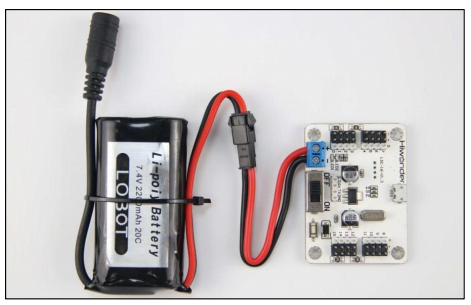
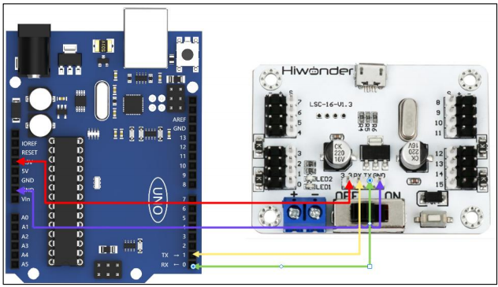
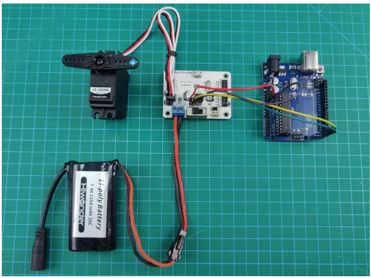
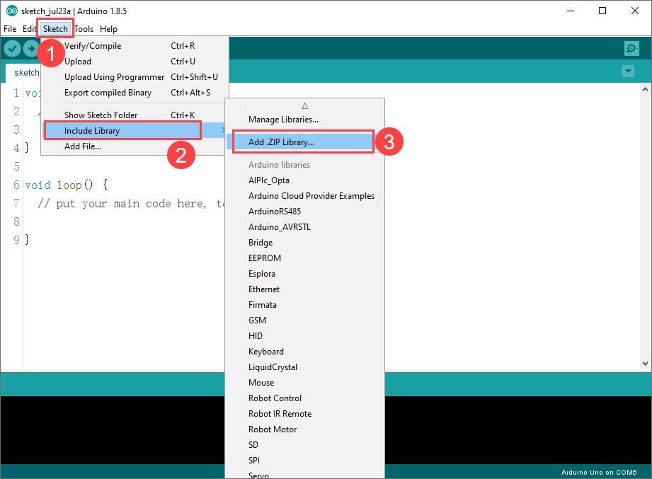
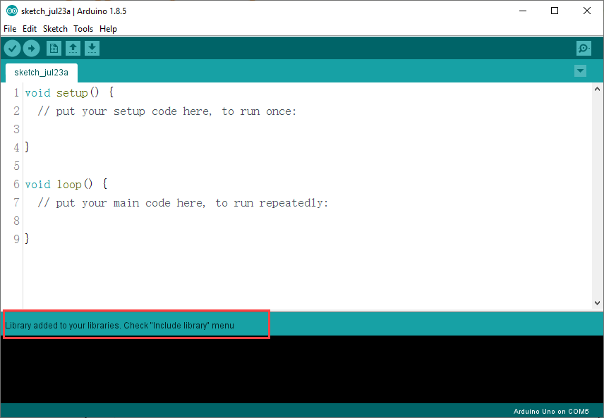
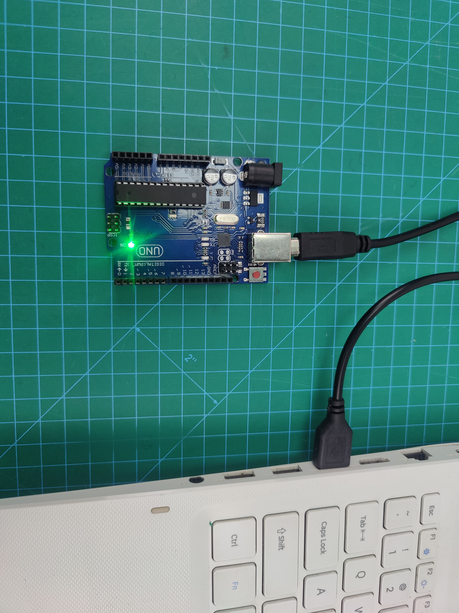
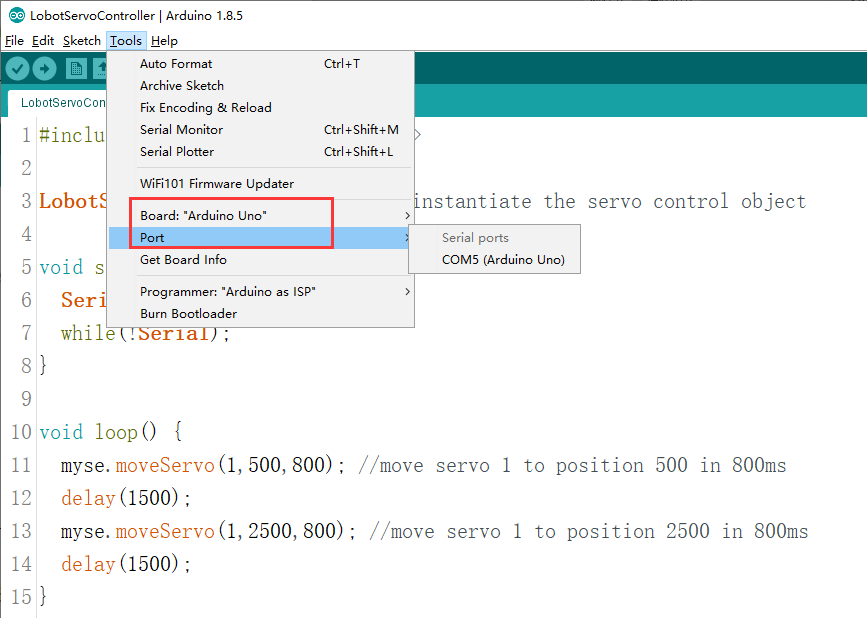
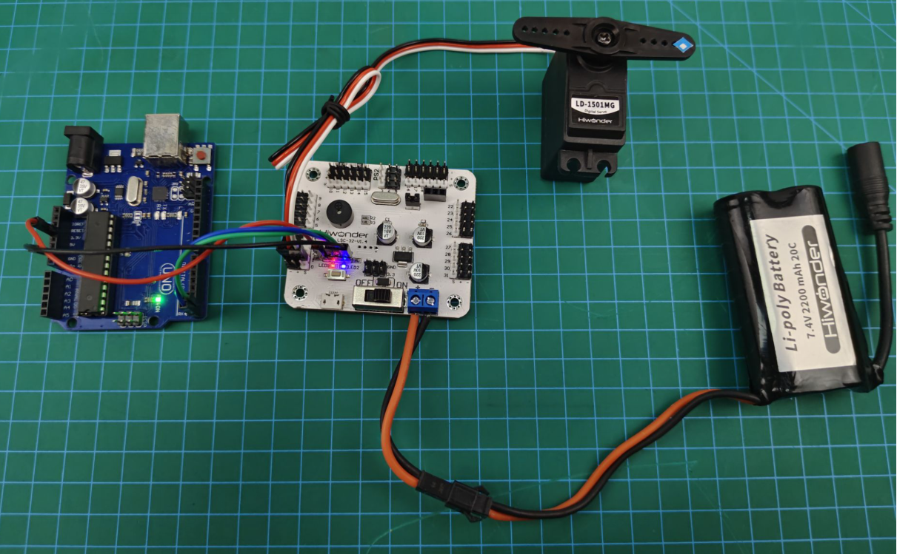

# 3. LSC-16 Controller Secondary Development-Arduino Development

## 3.1 Getting Ready

### 3.1.1 Wiring Instruction

This section employs Arduino UNO and 16-channel servo controller for development, powered by a 7.4V 2200mAh lithium battery. Connect the serial port on the 16-channel servo controller to the serial port on the Arduino UNO.

(1) Connect the battery cable to the power interface on the servo controller, and connect the lithium battery.

:::{Note}

Connect the red wire to "+", and the black wire to "-". The positive and negative poles must be matched correctly.



:::

(2) Use female-to-female DuPont wires to connect the Arduino UNO to the controller.

:::{Note}

Connect the TX and RX interfaces in reverse, GND to GND, and 3.3V to 3.3V.

:::



(3) Connect the servo to the interface 1 on the controller.



:::{Note}

* When using our lithium battery, connect the lithium battery interface wire with 

red to positive (+) and black to negative (-) to the DC port.

* If the interface wire is not connected to the lithium battery, do not 

directly connect it to the battery interface wire to avoid a short circuit between positive 

and negative poles, which may cause a short circuit.

* When connecting the serial ports, make sure to connect RX and TX correctly. Please refer to the images above.

* Before powering on, ensure that no metal objects come into contact with the controller. Otherwise, it may cause a short circuit and damage the controller due to its bottom pins.

:::

### 3.1.2 Environment Configuration

Install Arduino on PC. The software package is stored in [Appendix->Arduino Installation Package]().

* **Add Library File**

(1) Open Arduino IDE. Click **“Sketch -\> Include Library -\> Add .ZIP Library"**  in the menu bar.



(2) Locate and open the library file in [Library File]() (import before the first use)”.


(3) Return to the IDE. When the prompt shown in the following image appears, the library file is successfully added.



## 3.2 Development Case

### 3.2.1 Case 1 PWM Servo Rotation Control

In this case, commands are sent to the 16-channel servo controller to control the servo rotation via the serial port.

* **Run Program**

(1) Open the program **“LobotServoController.ino”** stored in [Case 1 PWM Servo Rotation Control]().

(2) After opening the program, add the library file based on [3.1.2 Environment Configuration->Add Library File]().

:::{Note}

You must add the library file when running the program for the first time. Otherwise, the program will report an error.

:::

(3) Connect Arduino UNO to your computer with a USB cable. Select the board type as **"Arduino UNO"** and the corresponding port.

:::{Note}

The port may not be unique. Arduino IDE will add the Arduino model after the corresponding port number.

:::





:::{Note}

When downloading the program, the serial ports of the Arduino UNO and the servo controller should be disconnected. Otherwise, the program will fail to be downloaded.

:::

(4) After Arduino UNO is connected, click to download the program. After the download is complete, follow [Wiring Instruction]() to connect the servo controller to the Arduino UNO. Then, switch the servo controller on. The servo 1 will start to rotate. 



* **Program Outcome**

After running the program, the servo will continuously rotate between the positions of 500 and 2500, with an interval of 1.5 seconds.

* **Program Analysis**

(1) Import the Required Function Package

{lineno-start=1}

```
#include <LobotServoController.h>
```

The function package mainly encapsulates various function modules for the 16-channel servo controller communication. The variables and functions defined in it can be used to control the servos.

(2) Initialize Serial Port

{lineno-start3=}

```
LobotServoController myse;     

void setup() {
  Serial.begin(9600);
  while(!Serial);
}
```

Instantiate the servo control object. Set the serial port baud rate to 9600.

(3) Servo Rotation Control

{lineno-start=10}

```
void loop() {
  myse.moveServo(1,500,800); //1号舵机800ms移动至500位置
  delay(1500);
  myse.moveServo(1,2500,800); //1号舵机800ms移动至2500位置
  delay(1500);
}
```

After running the main program, the  “moveServo()” function is called to rotate the servo 1 from positions 500 to 2500.

### 3.2.2 Case 2 PWM Servo Speed Control

In this case, commands are sent to the 16-channel servo controller to control the servo rotation via the serial port.

* **Run Program**

(1) Open the program **“LobotServoController.ino”** stored in “[Case 2 PWM Servo Speed Control]()”.

(2) After opening the program, add the library file based on “[3.1.2 Environment Configuration->Add Library File]()”.

:::{Note}

You must add the library file when running the program for the first time. Otherwise, the program will report an error.

:::

(2) Connect Arduino UNO to your computer with a USB cable. Select the board type as **"Arduino UNO"** and the corresponding port.

:::{Note}

The port may not be unique. Arduino IDE will add the Arduino model after the corresponding port number.

:::


:::{Note}

When downloading the program, the serial ports of the Arduino UNO and the servo controller should be disconnected. Otherwise, the program will fail to be downloaded.

:::

(4) After Arduino UNO is connected, click to download the program. After the download is complete, follow [3.1.1 Wiring Instruction]() to connect the servo controller to the Arduino UNO. Then, switch the servo controller on. The servo 1 will start to rotate. 

* **Program Outcome**

After running the program, the servo will rotate from position 500 to 2500 at a speed of 800ms. Then it will move back to position 500 at a speed of 1200ms.

* **Program Analysis**

(1) Import the Required Function Package

{lineno-start=1}

```
#include <LobotServoController.h>
```

The function package mainly encapsulates various function modules for the 16-channel servo controller communication. The variables and functions defined in it can be used to control the servos.

(2) Initialize Serial Port

{lineno-start=3}

```
LobotServoController myse;   

void setup() {
  Serial.begin(9600);
  while(!Serial);

}
```

Instantiate the servo control object. Set the serial port baud rate to 9600.

(3) Servo Rotation Control

{lineno-start=11}

```
void loop() {
  myse.moveServo(1,500,800); //1号舵机800ms移动至500位置
  delay(1500);
  myse.moveServo(1,2500,800); //1号舵机800ms移动至2500位置
  delay(1500);
  myse.moveServo(1,500,1200); //1号舵机1200ms移动至500位置
  delay(1500);
  myse.moveServo(1,2500,1200); //1号舵机1200ms移动至2500位置
  delay(1500);
}
```

After running the main program, the “moveServo()” function is called to control the rotation position and time of the servo 1. Then, the rotation time is adjusted to control the servo speed.

### 3.2.3 Case 3 Multiple Servos Rotation Control

In this case, commands are sent to the 16-channel servo controller to control multiple servos’ rotation via the serial port.

* **Run Program**

(1) Open the program **“LobotServoController.ino”** stored in [Case 3 Multiple Servos Rotation Control]().

(2) After opening the program, add the library file based on “Add Library File”.

:::{Note}

You must add the library file when running the program for the first time. Otherwise, the program will report an error.

:::

(3) Connect Arduino UNO to your computer with a USB cable. Select the board type as "Arduino UNO" and the corresponding port.

:::{Note}

The port may not be unique. Arduino IDE will add the Arduino model after the corresponding port number.

:::


:::{Note}

When downloading the program, the serial ports of the Arduino UNO and the servo controller should be disconnected. Otherwise, the program will fail to be downloaded.

:::

(4) After Arduino UNO is connected, click to download the program. After the download is complete, follow “[Wiring Instruction]()” to connect the servo controller to the Arduino UNO. Then, switch the servo controller on. The servo 1 will start to rotate. 

* **Program Outcome**

After running the program, servos 1 and 2 will continuously rotate between positions 500 and 2500, at an interval of 1.5 seconds. The number of manageable servos depends on the interfaces on the controller. Let’s demonstrate how to control two servos. If you want to control more servos, modify the code accordingly.

* **Program Analysis**

(1) Import the Required Function Package

{lineno-start=1}

```
#include <LobotServoController.h>
```

The function package mainly encapsulates various function modules for the 16-channel servo controller communication. The variables and functions defined in it can be used to control the servos.

(2) Initialize Serial Port

{lineno-start=3}

```
LobotServoController myse;     

void setup() {
  Serial.begin(9600);
  while(!Serial);
}
```

Instantiate the servo control object. Set the serial port baud rate to 9600.

(3) Servo Rotation Control

{lineno-start=10}

```
LobotServo servos[2];    

void loop() {
  servos[0].ID = 1;        
  servos[0].Position = 500;   
  servos[1].ID = 2;        
  servos[1].Position = 500;   
  myse.moveServos(servos,2,800);   
  delay(1500);
  servos[0].ID = 1;        
  servos[0].Position = 2500;   
  servos[1].ID = 2;        
  servos[1].Position = 2500;  
  myse.moveServos(servos,2,800);   
  delay(1500);
}
```

Before running the main program, define an array to control the servos. Store the servo IDs and positions to be controlled in the array. Call the “moveServos()” function to send the data in the array to the servo controller, enabling multiple servos control.

### 3.2.4 Case 4 Adjust Neutral Position and Deviation

In this case, commands are sent to the 16-channel servo controller via the serial port. Then, the servo controller controls the servo to rotate to the neutral position and deviation position.

The neutral position is assumed to be the initial position of the servo, which serves as the “zero point” for positive and negative angle rotation. Therefore, before installing the servo horn, the servo needs to be adjusted to the neutral position.

The servo deviation is caused by the interval between the teeth on the spline of the servo arm, which is a mechanical error. This can be adjusted through the program. In robots or robotic arms, if the deviation is not adjusted, it may restrict the movement of the robots. This affects the motion outcome.

* **Run Program**

(1) Open the program **“LobotServoController.ino”** stored in [Case 4 Adjust Neutral Position and Deviation]().

(2) After opening the program, add the library file based on “[3.1.2 Environment Configuration->Add Library File]()”.

:::{Note}

You must add the library file when running the program for the first time. Otherwise, the program will report an error.

:::

(3) Connect Arduino UNO to your computer with a USB cable. Select the board type as **"Arduino UNO"** and the corresponding port.

:::{Note}

The port may not be unique. Arduino IDE will add the Arduino model after the corresponding port number.

:::


:::{Note}

When downloading the program, the serial ports of the Arduino UNO and the servo controller should be disconnected. Otherwise, the program will fail to be downloaded.

:::

(4) After Arduino UNO is connected, click to download the program. After the download is complete, follow [Wiring Instruction]() to connect the servo controller to the Arduino UNO. Then, switch the servo controller on. The servo 1 will start to rotate. 

* **Program Outcome**

The servo returns to the neutral position. After a short delay, it rotates to the deviation angle and maintains that position.

* **Program Analysis**

(1) Import the Required Function Package

{lineno-start=1}

```
#include <LobotServoController.h>
```

The function package mainly encapsulates various function modules for the 32-channel servo controller communication. The variables and functions defined in it can be used to control the servos.

(2) Initialize Serial Port

{lineno-start=3}

```
LobotServoController myse;     

void setup() {
  Serial.begin(9600);
  while(!Serial);
}
```

Instantiate the servo control object. Set the serial port baud rate to 9600.

(3) Servo Rotation Control

{lineno-start=9}

```
uint8_t deviation;    
void loop() {
  myse.moveServo(1,1500,500);  
  delay(2000);
  deviation = 200;
  myse.moveServo(1,1500+deviation,200);  
  while(1);
}
```

Before running the main program, define the servo deviation. Rotate the servo to the neutral position. Wait for 2 seconds before adding the deviation angle to the neutral position. This allows the servo to rotate to the position corresponding to the deviation angle, and remain that position.
